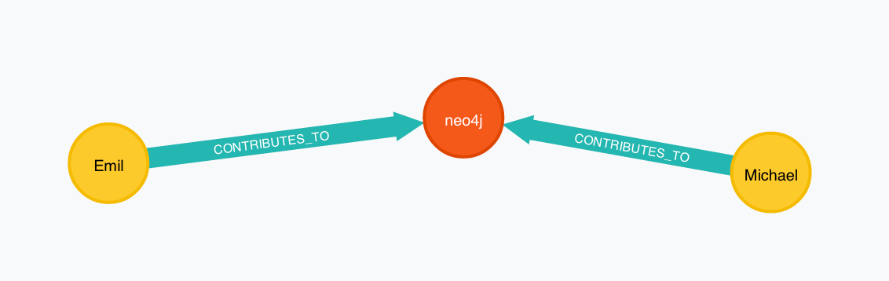

= A minimum viable JDBC - interaction with Neo4j

With http://neo4j.org/download[Neo4j 2.1] being released, I want to test out how easy it is to interact with the database
purely by means of "standard" Java database APIs. That means that communication should go via JDBC, and data import should use
the standard approach - prepared statements.

For this purpose, the maven project in https://github.com/peterneubauer/blogs/blob/master/csv_jdbc/pom.xml[`pom.xml`] is only minimal to pull in the neo4j and neo4j-jdbc driver artifacts:

[source,xml]
----
<dependency>
    <groupId>org.neo4j</groupId>
    <artifactId>neo4j</artifactId>
    <version>2.1.0</version>
</dependency>
<dependency>
    <groupId>org.neo4j</groupId>
    <artifactId>neo4j-jdbc</artifactId>
    <version>2.1.0-SNAPSHOT</version>
</dependency>
----

After adding another dependency on JUnit, it is time to write my https://github.com/peterneubauer/blogs/blob/master/csv_jdbc/src/test/java/org/neo4j/jdbctest/JDBCTest.java[test class]. First, I loaded the driver normally and opened
a connection to my local Neo4j server that I had installed and started on my OSX with

[source,bash]
---
brew install neo4j && neo4j start
---

Now, in order to load the Neo4j JDBC driver and connect to my local instance, I just do

[source,java]
----
//load the Neo4j JDBC driver class
Class.forName("org.neo4j.jdbc.Driver");

//connect to a vanilla default local neo4j server
Connection con = DriverManager.getConnection("jdbc:neo4j://localhost:7474/");
----

First, since this is a unit test and I want to start from a clean slate without restarting the server as part of my testing, I am just
emptying all data in the database with the cypher statement `match (n) optional match (n)-[r]-() delete n, r`:

[source,java]
----
Statement stmt = con.createStatement();
//delete all existing content
stmt.execute("match (n) optional match (n)-[r]-() delete n, r");
----

Now, a cool feature in the Neo4j implementation is the ability to submit Maps as parameters for a prepared statement, so I can put all the
properties of my first `neo4j` node into one parameter map:

[source,java]
----
//the property map for the "neo4j" node
final Map neo4jProperties = new HashMap();
neo4jProperties.put("name", "neo4j");
neo4jProperties.put("inception", 2007);

//insert some one-time data
final PreparedStatement insertNeo4j = con.prepareStatement("create (:Project {1})");
insertNeo4j.setObject(1, neo4jProperties);
insertNeo4j.execute();
----

For the next task, which is the bulk operation(s) normally found in data import tasks, I use a an array of names
as the "data source" and a prepared statement and parameters to optimize performance. In Neo4j 2.1 it is now even possible
to use CSV files as the import format out of the box using the http://docs.neo4j.org/chunked/stable/query-load-csv.html[`Load CSV`] function,
but raw JDBC is more convenient when you have for instance another RDBMS connection that you pull the data from directly in Java.

Now, in the Cypher `MATCH` clauses, you can reuse parameter maps through their values, so I can do something like this:

[source,java]
----
//some repetitive query as a prepared statement reusing the neo4j values in the parameters map
final PreparedStatement insertPeople = con.prepareStatement("" +
        "MATCH (neo4j:Project{name:{0}.name}) " +
        "CREATE ({name:{1}})-[:CONTRIBUTES_TO]->(neo4j)");
insertPeople.setObject(0, neo4jProperties);
//some bulk-data, possibly read from files or other data sources
String[] names = {"Michael", "Emil"};
for (String name : names) {
    insertPeople.setString(1, name);
    insertPeople.execute();
}
----

Inserting `Emil` and `Michael` as contributors to the previously created `Neo4j` node.

Just to assert that things are right, I tested a JDBC read operation and counted the results like this:

[source,java]
----
//some read query
ResultSet rs = stmt.executeQuery("match (n)-[:CONTRIBUTES_TO]->(:Project) return n.name as name");
int count = 0;
while (rs.next()) {
    System.out.println(rs.getString("name"));
    count++;
}

assertEquals(2, count);
----

Voilá, seems we have two Neo4j contributors in the database!

/peter