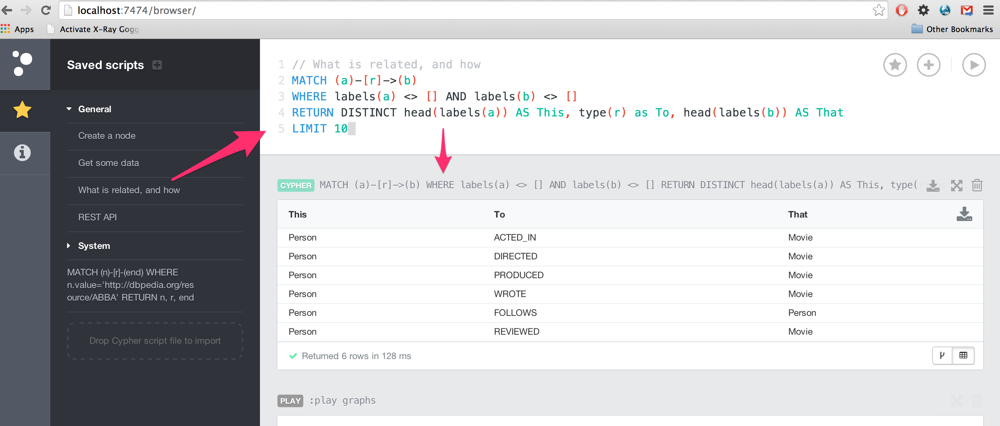
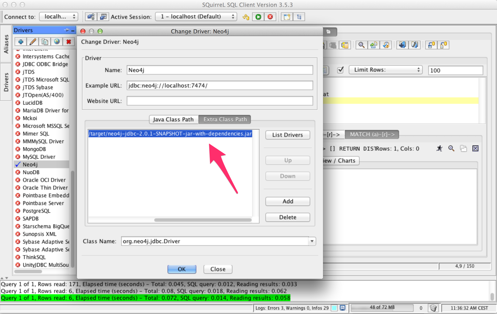
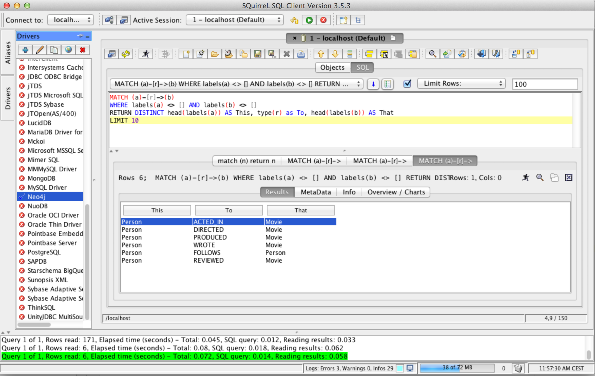

= The 10 min Neo4j/JDBC setup

Hi all,

Following up on our http://neo4j.com/blog/cypher-jdbc-tools-testing-results/[blog post on JDBC tools for Neo4j], I just wanted to check that
 things are still working with the recent Neo4j versions. Actually, things are even better now!

To start with, I decided to test the standard http://squirrel-sql.sourceforge.net/#installation[SquirrelSQL OSX installation], giving me an empty
insatllation. Now, in order to connect to neo4j, I built the Neo4j JDBC driver https://github.com/neo4j-contrib/neo4j-jdbc[from source], but you can just
download the JDBC driver http://dist.neo4j.org/neo4j-jdbc/neo4j-jdbc-2.0.1-SNAPSHOT-jar-with-dependencies.jar[here].

Next step is to install Neo4j. On my OSX machine, I simply do

[source, bash]
----
brew install neo4j && neo4j start
open http://localhost:7474/
----

and get to the web interface. In order to be able to see some data, I just insert the Movie-dataset and check that I get something back
with one of the standard built-in Cypher queries:

Ok, seems to work! Now on to adding the downloaded Neo4j JDBC driver to SquirrelSQL:

With that, I can just connect to my `http://localhost:7474` Neo4j URL without any authentication (you can add that later).
Now, let's take the same query from the Neo4j Browser and execute it through SquirrelSQL:

So, within just a few minutes I can get Neo4j installed, insert some data, and get a standard JDBC client up and running against it.
 Next we will look at how to do this from a Java program - stay tuned!

/peter

